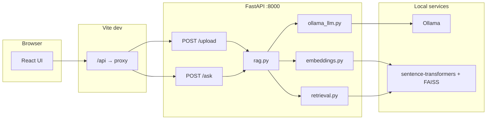

# RentSense AI — Rental contract RAG

Full-stack app that **uploads a rental-agreement PDF**, **indexes it locally** (embeddings + vector search), and uses a **local LLM (Ollama)** to produce a **dashboard** (rent, deposit, notice, risks, etc.) plus **grounded Q&A** over the same document. No cloud LLM keys are required for the main flow.

---

## Table of contents

1. [Features](#features)
2. [Architecture](#architecture)
3. [Prerequisites](#prerequisites)
4. [Quick start](#quick-start)
5. [Configuration](#configuration)
6. [Running the app](#running-the-app)
7. [HTTP API](#http-api)
8. [Frontend routes](#frontend-routes)
9. [Project layout](#project-layout)
10. [Troubleshooting](#troubleshooting)
11. [Legal disclaimer](#legal-disclaimer)

---

## Features

- **PDF upload** with text extraction (`pdfplumber`).
- **Chunking** and **sentence-transformers** embeddings, **FAISS** similarity search.
- **One-shot analysis** after upload: rental validation, contract field extraction, risks, conflicts, summary, recommendation.
- **Dashboard cards** with post-processing so long clauses (notice, utilities, termination, lease length) stay **short and readable**.
- **Chat** (`POST /ask`) grounded on retrieved chunks + document head (no full-PDF prompt by default).
- **Static marketing page** served at `/landingpage2.html` (Vite `public/`).
- **Dev proxy**: browser calls same-origin `/api/...` → FastAPI on port `8000`.

---

## Architecture



---

## Prerequisites

| Requirement | Notes |
|-------------|--------|
| **Python** | 3.11+ recommended (matches typical `torch` / `sentence-transformers` wheels). |
| **Node.js** | 18+ or 20+ for Vite 6. |
| **[Ollama](https://ollama.com/)** | Running locally (default `http://127.0.0.1:11434`). Pull a chat model, e.g. `ollama pull llama3.1:latest`. |
| **RAM / disk** | First embedding model download can be **hundreds of MB**; FAISS + PyTorch add memory use at runtime. |

---

## Quick start

### 1. Clone and enter the project

```bash
cd "ai-explain-my-contract (1)"
```

### 2. Backend (Python)

```bash
cd backend
python3 -m venv .venv
source .venv/bin/activate   # Windows: .venv\Scripts\activate
pip install -r requirements.txt
```

Ensure **Ollama** is running and the model exists:

```bash
ollama list
ollama pull llama3.1:latest   # or set OLLAMA_MODEL to a tag you have
```

### 3. Frontend (Node)

From the **repository root** (parent of `backend/`):

```bash
npm install
```

### 4. Environment

Copy the example and edit values:

```bash
cp .env.example .env
```

Load order for the backend is described in [`backend/env_load.py`](backend/env_load.py): it loads the first existing file among project root `.env`, `backend/.env`, and cwd `.env` (later files in the list can override depending on call order—prefer **one** canonical `.env` in the repo root or `backend/`).

---

## Configuration

Key variables (see [`.env.example`](.env.example) for the full list and comments):

| Variable | Purpose |
|----------|---------|
| `OLLAMA_HOST` | Ollama HTTP base URL (default `http://127.0.0.1:11434`). |
| `OLLAMA_MODEL` | Model tag, e.g. `llama3.1:latest` (must match `ollama list`). |
| `ST_EMBED_MODEL` | Hugging Face id for sentence-transformers (default `sentence-transformers/all-MiniLM-L6-v2`). |
| `VITE_API_URL` | **Production / explicit API base.** In dev, leave **unset** so the UI uses relative `/api` and the Vite proxy. If set to `http://127.0.0.1:8000`, the browser talks **directly** to FastAPI (CORS must allow your origin—`CORS_ORIGINS` on the API). |
| `CORS_ORIGINS` | Comma-separated origins for FastAPI (default `*`). |
| `ANALYSIS_MAX_CHUNKS`, `ANALYSIS_K_PER_QUERY` | Wider retrieval for upload-time analysis. |
| `CHAT_TOP_K`, `CHAT_HEAD_CHUNKS` | Chat retrieval + head chunks. |
| `OLLAMA_NUM_CTX`, `OLLAMA_NUM_PREDICT_*` | Optional caps for Ollama generation (see `.env.example`). |

Optional tuning for dashboard copy lives in **`backend/rag.py`** (prompts + `_compact_*` helpers).

---

## Running the app

You need **two terminals**: API + UI.

### Terminal A — FastAPI

```bash
cd backend
source .venv/bin/activate
uvicorn app:app --reload --host 127.0.0.1 --port 8000
```

Health check:

```bash
curl http://127.0.0.1:8000/health
# {"status":"ok"}
```

### Terminal B — Vite (port **5173**)

From the **repo root**:

```bash
npm run dev
```

Open **http://localhost:5173** (or the host/port shown in the terminal).

**Production build:**

```bash
npm run build
npm run preview
```

Static assets in `public/` (including `landingpage2.html`) are copied to `dist/` and served at the same paths.

---

## HTTP API

Base URL in dev (via proxy): **`/api`** on the Vite origin. Direct backend: **`http://127.0.0.1:8000`**.

| Method | Path | Description |
|--------|------|-------------|
| `GET` | `/health` | Liveness / JSON `{"status":"ok"}`. |
| `POST` | `/upload` | `multipart/form-data` with a single PDF field `file`. Extracts text, builds session, runs analysis. Returns `session_id` + `analysis` on success, or `status: "rejected"` for non-rental PDFs. |
| `POST` | `/ask` | JSON body `{ "session_id": "<uuid>", "question": "..." }`. Returns `{ "answer": "..." }`. |

### Upload responses

- **`status: "approved"`** — includes `session_id`, `analysis` (dashboard fields, risks, summary, etc.), `chunks_indexed`.
- **`status: "rejected"`** — `reason`, `supported_inputs`, `next_step`; no valid `session_id` for chat.

### Error codes (typical)

| Code | Meaning |
|------|---------|
| `400` | Not a PDF, empty file, or PDF parse failure. |
| `422` | Extracted text shorter than backend minimum (`MIN_TEXT_CHARS` in `app.py`). |
| `404` | `/ask` with unknown or expired `session_id`. |
| `503` | Ollama unreachable or service error (`OllamaServiceError`); message is plain `detail` text. |
| `500` | Indexing or unexpected analysis failure. |

---

## Frontend routes

The SPA (`src/App.tsx`) uses in-memory state plus the URL for a few entry points:

| URL | Behavior |
|-----|----------|
| `/` | Main app (landing → upload → analysis). |
| `/upload` | Opens directly on the **upload** step (full page load supported). |
| `/landingpage2.html` | **Static** marketing page from `public/landingpage2.html` (also kept as source copy at repo root for editing). |

The static page’s **“Upload your contract”** link targets `/upload` so users jump into the app flow.

---

## Project layout

```
├── README.md                 # This file
├── .env.example              # Environment template
├── index.html                # Vite HTML shell
├── package.json              # Frontend scripts & deps
├── vite.config.ts            # React plugin, Tailwind, /api proxy
├── public/
│   └── landingpage2.html     # Served at /landingpage2.html
├── landingpage2.html         # Optional duplicate for editing / sharing
├── src/
│   ├── main.tsx
│   ├── App.tsx               # LANDING | UPLOAD | ANALYZING | RESULT | ERROR
│   ├── types.ts
│   ├── services/api.ts       # fetch /api/upload, /api/ask
│   ├── components/
│   │   ├── LandingPage.tsx   # In-app RentSense-style landing
│   │   ├── UploadZone.tsx
│   │   └── AnalysisDashboard.tsx
│   └── lib/utils.ts
└── backend/
    ├── requirements.txt
    ├── env_load.py
    ├── app.py                # FastAPI routes
    ├── parser.py             # PDF → text
    ├── embeddings.py         # ST encode + optional disk cache
    ├── retrieval.py          # FAISS ChunkStore
    ├── ollama_llm.py         # JSON + text completions
    └── rag.py                # Chunking, analysis prompt, chat, session store
```

---

## Troubleshooting

### `Address already in use` on port 8000

Something else is bound to **8000**. Find and stop it:

```bash
lsof -nP -iTCP:8000 -sTCP:LISTEN
kill -9 <PID>
```

Then start `uvicorn` again.

### Ollama errors (503 from API)

- Confirm Ollama is running: `curl -s http://127.0.0.1:11434/api/tags`
- Pull the model you configured: `ollama pull <OLLAMA_MODEL>`
- If the model name omits a tag, prefer an explicit tag (e.g. `llama3.1:latest`).

### First upload is slow

The embedding model may **download on first use**; subsequent runs use caches under `backend/.cache/` (see `embeddings.py`).

### Gemini / Google quota errors (429) in the UI

The **local** stack (`FastAPI` + `Ollama`) does **not** call the Gemini HTTP API. Your `src/` code only talks to **`/api/upload`** and **`/api/ask`**.

If you still see JSON mentioning `generativelanguage.googleapis.com`, `gemini-2.0-flash`, or **free tier quotas**, the request is coming from **outside this backend**, for example:

- **[Google AI Studio](https://aistudio.google.com/)** preview or hosted runtimes that wire the template to Gemini.
- Another tab, extension, or **Cursor** feature using Gemini.
- A **misconfigured** `VITE_API_URL` pointing at a non–self-hosted endpoint (very rare).

**Fix:** Run the app locally with **`npm run dev`** + **`uvicorn`** (see README), ensure **`VITE_API_URL` is unset** in dev so the browser uses the **`/api` proxy** to `127.0.0.1:8000`, and keep **Ollama** running with **`OLLAMA_MODEL`** pulled locally.

The **`@google/genai`** package was removed from this repo because it was unused; if you still open the project inside AI Studio, rely on **local** dev servers for contract analysis, not Studio’s Gemini quota.

### `VITE_API_URL` and CORS

If the browser calls `http://127.0.0.1:8000` **directly**, ensure `CORS_ORIGINS` includes your frontend origin (e.g. `http://localhost:5173`). Using **relative `/api` in dev** avoids this.

### Gemini-style JSON errors in the browser

Responses like `{"error":{"code":503,"status":"UNAVAILABLE",...}}` are from **Google’s Generative Language API**, not from this FastAPI app’s normal `detail` format. This stack is **Ollama-first**; if you see that payload, another client or integration is calling Google, not this backend.

### Dependency `@google/genai` in `package.json`

It is present in the Node lockfile/deps but the **documented runtime path** for this repo is **local Ollama + FastAPI**. You can remove unused packages in a fork if you want a slimmer install.

---

## Legal disclaimer

This tool produces **AI-generated summaries for informational purposes only**. It is **not legal advice**. Rental law varies by jurisdiction; always consult a qualified attorney for decisions about signing, terminating, or disputing a lease.

---

## Scripts reference

| Command | Where | Purpose |
|---------|--------|---------|
| `npm run dev` | repo root | Vite dev server at **http://localhost:5173** (see `vite.config.ts`). For all interfaces: `VITE_DEV_HOST=0.0.0.0 npm run dev`. |
| `npm run build` | repo root | Production bundle → `dist/`. |
| `npm run preview` | repo root | Serve `dist/` locally. |
| `npm run lint` | repo root | `tsc --noEmit`. |
| `uvicorn app:app --reload --host 127.0.0.1 --port 8000` | `backend/` | API server. |

---

## Contributing / forking

1. Keep **`.env`** and API keys out of git (use `.env.example` only as a template).
2. After changing **`backend/rag.py`** prompts or retrieval, **re-upload** a PDF to see new extraction behavior (sessions are in-memory until restart).

If you extend the API, update **`src/services/api.ts`** and **`src/types.ts`** together so the UI stays type-safe.
